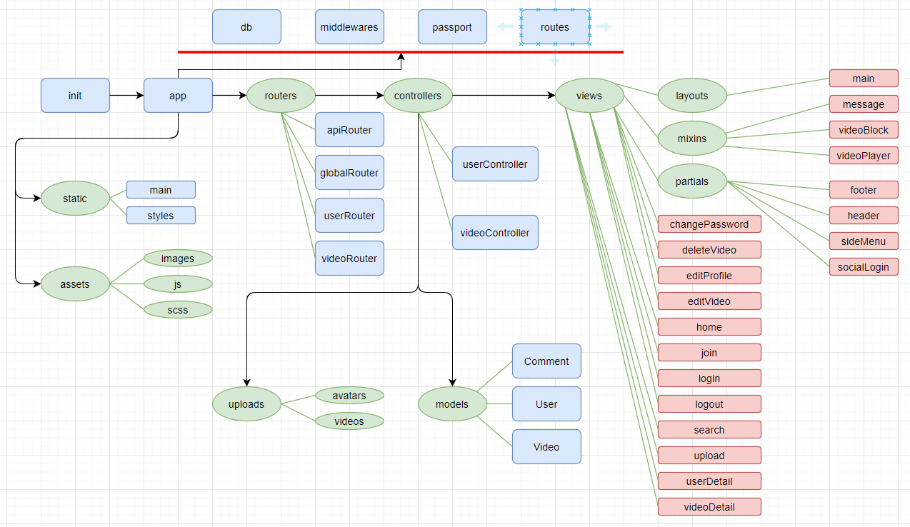
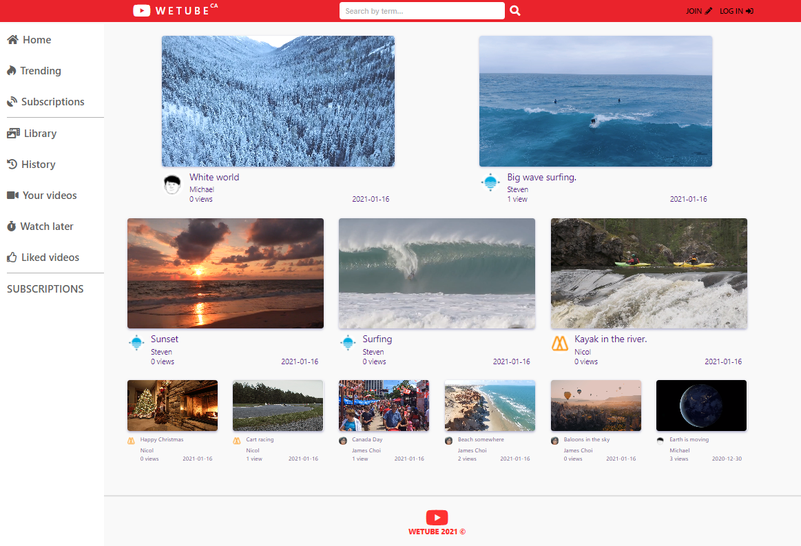

# WeTube

## Overview
This project is for handling videos like YouTube with fullstack technologies. An user can create
an account using OAuth, record a self video, upload videos and put comments on each video.
Editing user and video information is available. We can operate a video community with this site.

## Technology Stack
* **Front End**: HTML(Pug), CSS(SCSS), JavaScript(ES6), AJAX, Babel, Webpack
* **Back End**: NodeJS, Express, Passport, MongoDB Atlas, AWS S3, Multer
* **Infrastructure**: Heroku
* **Workflow**
  
  *[Workflow]*
  
## Results
I could create this application taking online course at [NOMAD CODERS](https://en.nomadcoders.co/wetube), then I fixed bugs, decorated styles, and added new features to polish UI/UX for better user friendly. I imporvoed fullstack knowledge and skills through practicing many web technologies from Front End - Middleware - Back End. By applying MVC model, it was effieiently and easily understandable to handel Model and View parts with controllers.  
 
The [DEMO](https://murmuring-hollows-75711.herokuapp.com/) site is up, you can enjoy uploaded vidoes and upload your own videos. After joining the site, you can also put comments on videos.


*[WeTube Main Page]*

## Features
* **Video**
  * Upload - video format can be uploaded
  * Edit - title, contents
  * Record - self video
  * Owner Information - display owner name and link to their home
  * Customized Video Player - volume control, fullscreen, forward & backward play
* **User**: 
  * Join - create user account using e-mail or OAuth
  * Profile - edit name, e-mail, avatar image
* **Authentication**: 
  * Local Auth
  * Google Auth
  * Github Auth

## Install
There are some configurations to be set using **dotenv** for MongoDB, Google & Github Auth, AWS (if you use for image & video storage).
```
MONGO_URL=
MONGO_URL_PROD=
PORT=4000
COOKIE_SECRET=
GH_ID=
GH_SECRET=
GOOGLE_ID=
GOOGLE_SECRET=
FB_ID=
FB_SECRET=
AWS_KEY=
AWS_PRIVATE_KEY=
```

> Reference: [NOMAD CODERS](https://en.nomadcoders.co/wetube)
